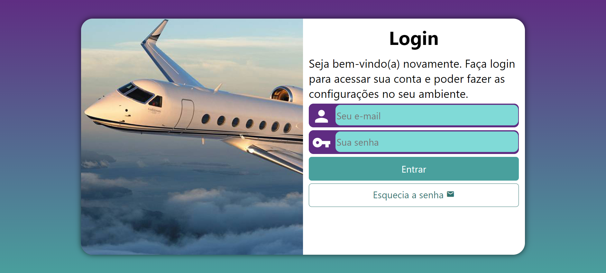

# Projeto-login

## 📌 About ##

Português:   

Projeto de HTML e CSS - Módulo 4
Este projeto foi desenvolvido como parte do curso de HTML e CSS do Professor Guanabara, no Módulo 4. Ele abrange várias funcionalidades e técnicas que são essenciais para o desenvolvimento web moderno.

Funcionalidades e Técnicas Utilizadas:  
Media Queries: Implementação de design responsivo para diferentes dispositivos.  
Transições: Aplicação de efeitos de transição suave em elementos da página.  
Botões com Hover: Criação de botões interativos com efeitos de hover.  
Formulário de Login:  Desenvolvimento de um formulário de login funcional e estilizado.    
Objetivo:
O objetivo principal deste projeto é consolidar os conhecimentos adquiridos em HTML e CSS, aplicando-os em um projeto prático que simula cenários reais de desenvolvimento web. Este projeto serve como base para futuros estudos e aprimoramentos na área de desenvolvimento front-end.

English:

HTML and CSS Project - Module 4
This project was developed as part of Professor Guanabara's HTML and CSS course, in Module 4. It encompasses various functionalities and techniques essential for modern web development.

Features and Techniques Used:  
Media Queries: Implementation of responsive design for different devices.  
Transitions: Application of smooth transition effects on page elements.  
Hover Buttons: Creation of interactive buttons with hover effects.  
Login Form: Development of a functional and styled login form.    
Objective:
The main objective of this project is to consolidate the knowledge acquired in HTML and CSS by applying them in a practical project that simulates real-world web development scenarios. This project serves as a foundation for future studies and improvements in the front-end development field.
 
 ## ⚒️ Tools 

- HTML5    
&nbsp;

- CSS3    
&nbsp;

## 💻 Preview <a href="https://pceraa.github.io/projeto-login/" target="_blank">🔗</a>

## 📃 License 

This project is under the MIT license. See the file [LICENSE](./LICENSE) for more details
